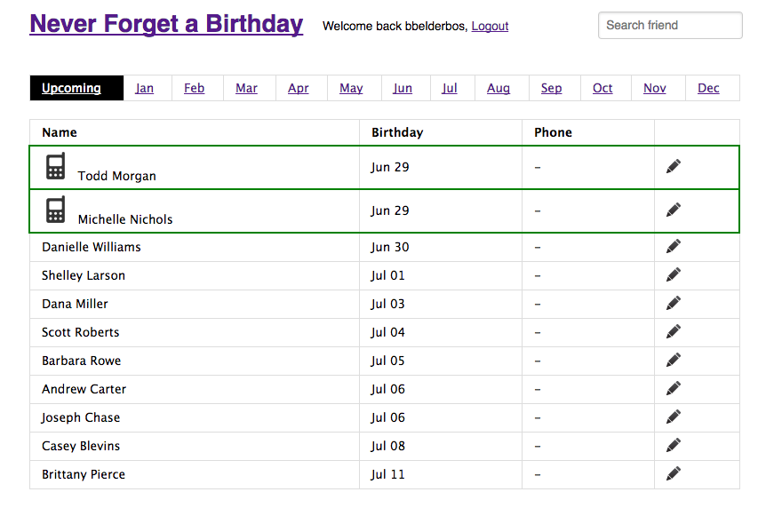

# Never Forget A Friend's Birthday with Python, Flask and Twilio 

This app lets you:

- import your Facebook birthday calendar,
- send SMS notification messages of upcoming birthdays,
- send text messages and simple ecards via SMS.

## Installation

1. Clone this repo:

		$ git clone https://github.com/pybites/bday-app

2. Populate SQLite database with birthdays 

	- Export your birthday calendar from Facebook and save it as `cal.ics` in the app's toplevel directory.
	- Run `model.py` to import the birthdays into the DB. Use it with `-t` if you want to strip out real names.

			$ python model.py

3. Make a virtual env and install dependencies:

		$ python3 -m venv venv 
		$ source venv/bin/activate
		$ pip install -r requirements.txt

## Configuration

1. Create a Twilio account, get a phone number and API key and token.

2. Copy the [settings template](https://github.com/pybites/bday-app/blob/master/env-example.conf) in place:

		$ cp env-example.conf env.conf

3. Update it with the correct settings:
	
	* twilio_api section = from step 1
	* twilio phone = from step 1
	* admin phone = your number, where you want to receive notification messages
	* login section = define login for the Flask app
	* server = unchanged if running locally, update to URL if deployed elsewhere

	> NOTE: make sure you use E.164 number formatting for phone numbers (e.g. +34666555444, +442071838750). See Twilio's support article: [Formatting International Phone Numbers](https://support.twilio.com/hc/en-us/articles/223183008-Formatting-International-Phone-Numbers).

## How to run it

1. Kick off [the notifier cronjob](https://github.com/pybites/bday-app/blob/master/notify.py) to receive SMS notifications to your configured admin phone:

		$ nohup ./notify.py &
	
2. Start the Flask app to access the front-end: 

		$ python app.py
